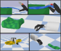

[](https://github.com/dfki-ric/deformable_gym/actions/workflows/test.yaml)
[](https://github.com/psf/black)
[](https://github.com/pre-commit/pre-commit)
[](https://doi.org/10.5281/zenodo.15742434)

# DeformableGym

This repository contains a collection of [gymnasium](https://github.com/Farama-Foundation/Gymnasium) environments built with [PyBullet](https://pybullet.org/) and [MuJoCo](https://github.com/google-deepmind/mujoco).
In these environments, the agent needs to learn to grasp deformable 3D objects such as shoe insoles or pillows from sparse reward signals.

<p align="center">
  
</p>

## Installation

```bash
git clone git@github.com:dfki-ric/deformable_gym.git
```

After cloning the repository, it is recommended to install the library in editable mode.

```bash
pip install -e .
```

## Available environments

| Environment Name          |      PyBullet      |       MuJoCo       |
| ------------------------- | :----------------: | :----------------: |
| FloatingMiaGraspInsole    | :heavy_check_mark: | :heavy_check_mark: |
| FloatingShadowGraspInsole | :heavy_check_mark: | :heavy_check_mark: |
| FloatingMiaGraspPillow    | :heavy_check_mark: | :heavy_check_mark: |
| FloatingShadowGraspPillow | :heavy_check_mark: | :heavy_check_mark: |
| URMiaGraspInsole          | :heavy_check_mark: | :heavy_check_mark: |
| URShadowGraspInsole       | :heavy_check_mark: | :heavy_check_mark: |
| URMiaGraspPillow          | :heavy_check_mark: | :heavy_check_mark: |
| URShadowGraspPillow       | :heavy_check_mark: | :heavy_check_mark: |

### Known Issues

If you use conda, you may experience the error below:

```
libGL error: MESA-LOADER: failed to open iris: /usr/lib/dri/iris_dri.so: cannot open shared object file: No such file or directory (search paths /usr/lib/x86_64-linux-gnu/dri:\$${ORIGIN}/dri:/usr/lib/dri, suffix _dri)
libGL error: failed to load driver: iris
libGL error: MESA-LOADER: failed to open swrast: /usr/lib/dri/swrast_dri.so: cannot open shared object file: No such file or directory (search paths /usr/lib/x86_64-linux-gnu/dri:\$${ORIGIN}/dri:/usr/lib/dri, suffix _dri)
libGL error: failed to load driver: swrast
```
In this case, install the following dependency via conda-forge:

```bash
conda install -c conda-forge libstdcxx-ng
```

## Example

<p align="center">
  
</p>

Here is an example of how to run a random agent in the FloatingMiaEnv. More can be found in the `examples/` folder.

```Python
import gymnasium

"""
=========
Floating Mia Example
=========

This is an example of how to use the FloatingMiaGraspEnv. A random policy is then
used to generate ten episodes.

"""

env = gymnasium.make("FloatingMiaGraspInsole-v0")

env.reset()
episode_return = 0
num_episodes = 0

while num_episodes <= 10:

    action = env.action_space.sample()

    state, reward, terminated, truncated, _ = env.step(action)
    episode_return += reward

    if terminated or truncated:
        print(f"Episode finished with return {episode_return}!")
        num_episodes += 1

        env.reset()

```

## Documentation

The documentation can be found in the directory doc. To build the documentation, run e.g. (on linux):

```bash
cd doc
make html
```

The HTML documentation is now located at doc/build/html/index.html. You need the following packages to build the documentation:

```bash
pip install numpydoc sphinx sphinx-gallery sphinx-bootstrap-theme
```

## Contributing

If you wish to report bugs, please use the [issue tracker](https://github.com/dfki-ric/deformable_gym/issues). If you would like to contribute to DeformableGym, just open an issue or a
[pull request](https://github.com/dfki-ric/deformable_gym/pulls). The target branch for
merge requests is the development branch. The development branch will be merged to main for new releases. If you have
questions about the software, you should ask them in the discussion section.

The recommended workflow to add a new feature, add documentation, or fix a bug is the following:

- Push your changes to a branch (e.g. feature/x, doc/y, or fix/z) of your fork of the deformable_gym repository.
- Open a pull request to the latest development branch. There is usually an open merge request from the latest development branch to the main branch.
- When the latest development branch is merged to the main branch, a new release will be made.

Note that there is a checklist for new features.

It is forbidden to directly push to the main branch. Each new version has its own development branch from which a pull request will be opened to the main branch. Only the maintainers of the software are allowed to merge a development branch to the main branch.

## Referencing

If you use DeformableGym in your research, please consider citing it. You may find the paper [here](https://deformable-workshop.github.io/icra2023/spotlight/03-Laux-spotlight.pdf).

```
@inproceedings{Laux2023,
title = {Grasping 3D Deformable Objects via Reinforcement Learning: A Benchmark and Evaluation},
booktitle = {3rd Workshop on Representing and Manipulating Deformable Objects @ ICRA2023},
author = {Melvin Laux and Chandandeep Singh and Alexander Fabisch},
month = {May},
year = {2023},
url = {https://deformable-workshop.github.io/icra2023/},
}
```

## Releases

### Semantic Versioning

[Semantic versioning](https://semver.org/) must be used, that is, the major version number will be
incremented when the API changes in a backwards incompatible way, the minor
version will be incremented when new functionality is added in a backwards
compatible manner, and the patch version is incremented for bugfixes,
documentation, etc.

## Funding

This library has been developed initially at the
[Robotics Innovation Center](http://robotik.dfki-bremen.de/en/startpage.html) of the
[German Research Center for Artificial Intelligence (DFKI)](http://www.dfki.de) in Bremen together with the
[Robotics Group](https://robotik.dfki-bremen.de/en/about-us/university-of-bremen-robotics-group.html) of the
[University of Bremen](http://www.uni-bremen.de/en.html). At this phase, the work was supported through a grant from the European
Commission (870142).

<p float="left">
    
    
</p>
